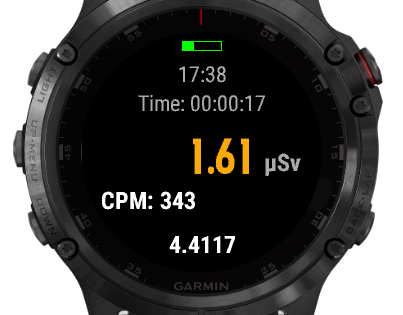

# AtomAppGN
Atom Fast dosimeter application for Garmin devices

This application is not making a Garmin device a dosimter. 
It uses an Atom Fast device to read and show the data.

For more information about AtomFast dosimeters plsease visit the page https://kbradar.org/p223290497-dozimetr-radiatsii-atom.html

### Compatible devices:

The list of the devices supported by Connection IQ can be found here: https://developer.garmin.com/connect-iq/compatible-devices/

The device should support at least version 3.0. 

## Important! 

The device MUST have "Generic Bluetooth Low Energy Channel" feature supported. To check if your device supports it, find the device in the list above, press the blue (i) symbol. If there is "Generic Bluetooth Low Energy Channel" feature in the list shown, the device, higly probably, can run the appplication. 
